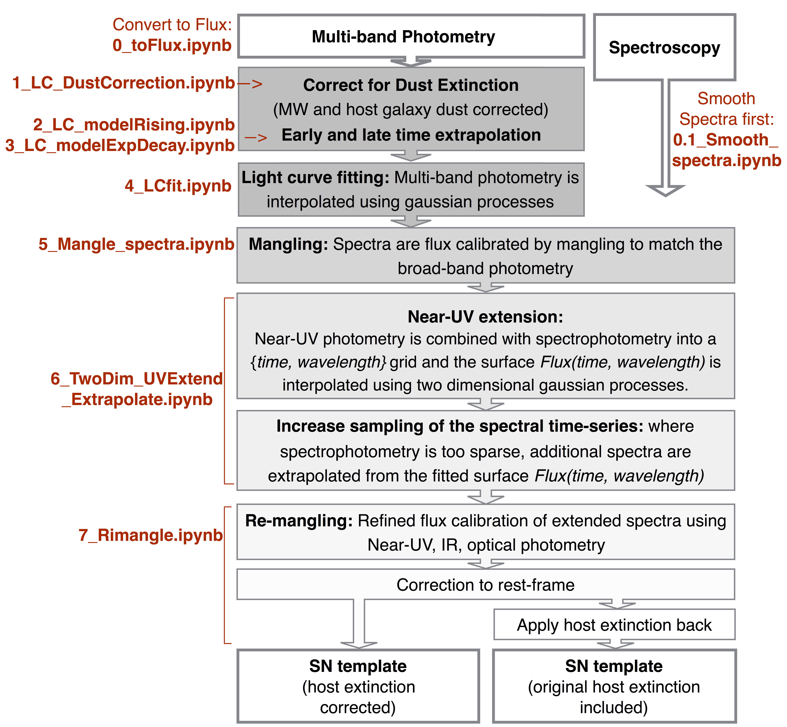

# PyCoCo_templates
Building templates of ANY transient for which you have photomtry and sparse spectroscopy

References: https://arxiv.org/abs/1908.05228

You will need:
- Python3 and all the basics packages (numpy, scipy ..)
- The Pakcage george (version 0.3.1 at least, https://george.readthedocs.io/en/latest/)
## Build your own template: Instructions

**STEP 0**: Clone this github repo and set the envoimental variable COCO_PATH to the path where you cloned the folder
i.e. export COCO_PATH="/Users/mariavincenzi/PyCoCo_templates/"

**STEP 1**:

All the inputs (Photometry, Spectroscopy, Other info about the transient like Galactic/host extinction, Redshift...), Filter transmission function) should be placed in ./Inputs
See example provided to check which format all these info should be provided.

All the outputs (LC fit, mangled spectra, various plots and final template) will be created in Outputs.

Take a look at Figure 1 in the Paper.
Each step of the process corresponds to a jupyter notebook in the folder ./Codes.

